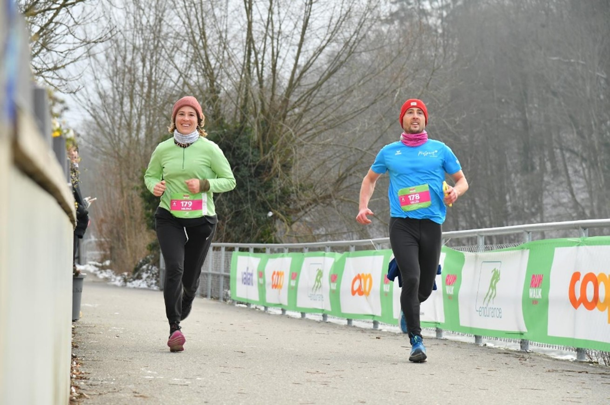
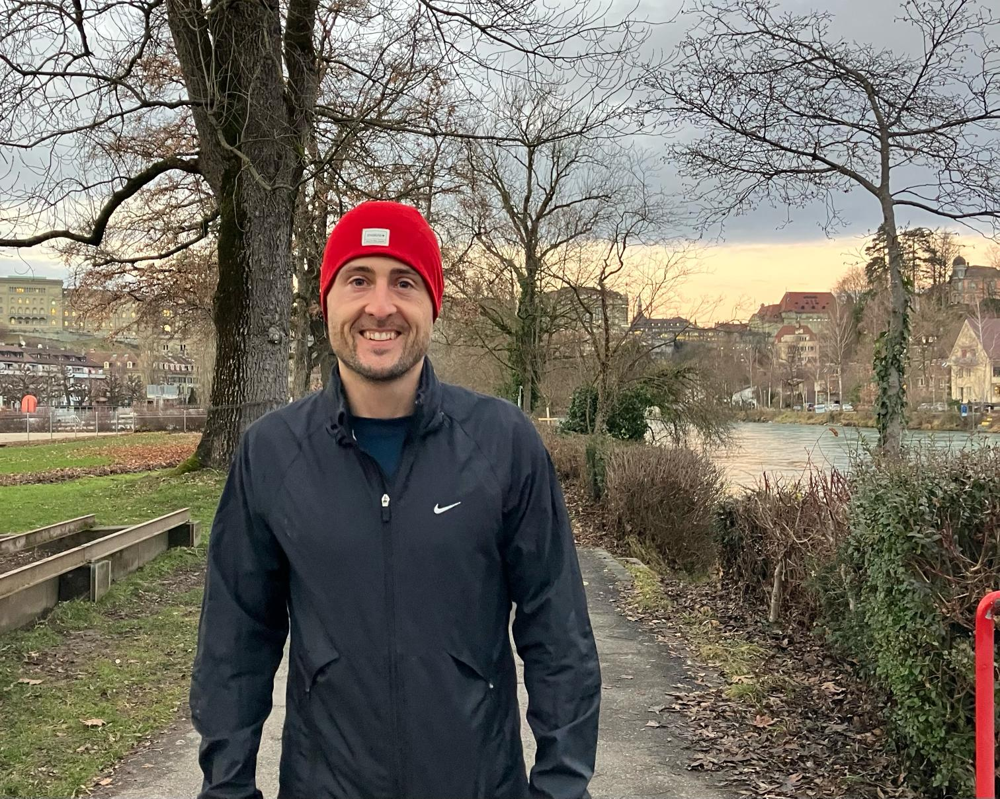

+++
title = "Sport verbindet"
date = "2024-02-24"
draft = false
pinned = true
tags = ["PluSport", "Menschenerfolg"]
image = "gilles-bigler-am-never-walk-alone.jpg"
description = "Gilles Bigler beweist trotz Sehnerv-Atrophie, dass Aufgeben keine Option ist. Mit beeindruckendem Durchhaltevermögen, Willenskraft und der Unterstützung von PluSport überwindet er seine Krise nach der niederschmetternden Diagnose."
+++


Gilles Bigler beweist trotz Sehnerv-Atrophie, dass Aufgeben keine Option ist. Mit beeindruckendem Durchhaltevermögen, Willenskraft und der Unterstützung von PluSport überwindet er seine Krise nach der niederschmetternden Diagnose.



Luana Rentschler und Nea Hofer 

Nur noch wenige Minuten bis mitten in Bern, schön gelegen an der Aare, der Startschuss zum diesjährigen «Run and Walk» ertönt. Es werden noch letzte Aufwärmübungen gemacht, Laufschuhe geschnürt, einige Worte mit den Liebsten ausgetauscht, bis man sie nach zehn Kilometern wieder sieht. Für ein Geburtstagskind setzt der Veranstalter ein «Happy Birthday» an, und alle stimmen mit ein. Jetzt ist es so weit, aus den Lautsprechern hört man: «Drei, zwei, eins, peng», die Läufer*innen rennen los. Die Zeit läuft, nach einer halben Stunde laufen die Ersten bei eisigen Temperaturen unter dem schwarzen Zielbogen ins Ziel. Coop als Hauptsponsor macht es mit Hilfe von PluSport beeinträchtigten Sportlerinnen möglich, kostenlos an Laufveranstaltungen des «never walk alone»-Projekts teilzunehmen. So macht auch Gilles Bigler jedes Jahr an diesem Lauf mit. «Ich liebe solche Volksläufe», meint Gilles Bigler, «diese Atmosphäre vor dem Start ist unglaublich». Er findet es zudem motivierend, dass PluSport beeinträchtigte Sportlerinnen unterstützt und es ihnen ermöglicht, an Sportveranstaltungen teilzunehmen. Für Gilles ist Laufsport schon lange eine grosse Leidenschaft, wie auch für viele andere Menschen, egal ob mit oder ohne Beeinträchtigung. 

#### Überwindung durch Bewegung

Gilles Bigler betreibt seit 14 Jahren Laufsport und führt ein ganz normales Leben. Vor einigen Jahren erhielt er die Diagnose einer Sehnerv-Atrophie, dies ist eine degenerative Erkrankung mit zunehmendem Schwund des Sehnervs. Heute ist Gilles’ Visus eingeschränkt und er sieht verschwommen.
Die Hiobsbotschaft war ein harter Schlag für ihn und seine Familie. In einer Klinik konnte er seine anfängliche Hoffnungslosigkeit überwinden und wieder Fuss fassen. Er musste sich beruflich neu orientieren und wechselte vom Schreibtisch zu einer Massageliege. Als Masseur kann Gilles die Augen schliessen und über seinen Tastsinn arbeiten. Nebst der Arbeit als Therapeut engagiert sich Gilles bei der Firma Menschenerfolg und begleitet Personen, welche in einer Krise stecken oder mit mehr Energie durchs Leben gehen wollen. Wie er selbst auf seiner Homepage beschreibt: «Mit meinen Angeboten befähige ich Menschen, ihr Leben proaktiv und freudvoll zu gestallten und sich vital und stark zu fühlen».
Nicht nur seinen Alltag musste Gilles neu gestalten, auch beim Laufen gab es zunehmend Schwierigkeiten und Hürden zu überwinden. So muss er, je nach Strecke, das Tempo anpassen, da er nur bis zu zwei Metern eine scharfe Sicht hat. Beim Laufen spielen aber auch die Lichtverhältnisse eine wichtige Rolle. 
Aufgeben war für Gilles nie eine Option. Heute merkt man seiner aufgestellten Art und motivieren-den Einstellung kaum an, was er durchgemacht hat.

#### Sport ohne Grenzen

«Never walk alone» ist eines der erfolgreichsten Inklusionsprojekte von PluSport. Das Ziel ist es, dass sich kleinere sowie grössere Laufveranstaltungen immer mehr für Menschen mit Beeinträchtigung öffnen. Immer mehr Veranstalter sind bereit mitzumachen und es kommen ständig neue dazu, mittlerweile sind es über 80 in der Schweiz. Die Idee hinter solchen Läufen ist die Inklusion von Beeinträchtigten. So können Menschen mit und ohne Beeinträchtigung zusammen laufen, sich bewegen und messen.

> «Das ist das Schöne»
>
>  meint Reto Planzer, Fachspezialist Inklusion.*

Der grösste und wichtigste Anlass ist der jährliche stattfindende PluSport-Tag in Magglingen. 1000 Sportbegeisterte treiben zusammen Sport und messen sich in unterschiedlichen Wettkämpfen. Ein solches Happening ist jedes Jahr wieder ein Highlight, auch für Mitarbeitende wie Reto Planzer. Wie Reto Planzer sagt, ist es extrem schön die PluSportlerinnen persönlich zu treffen, mit denen man sonst nur telefonisch oder schriftlich in Kontakt ist. Der persönliche Austausch ist sehr wichtig für eine gute Zusammenarbeit und dieser wird vor allem an solchen Anlässen gepflegt. Die Finanzierung solcher Projekte ist nicht immer einfach. Heute wird PluSport ungefähr zu 30 Prozent durch Spenden finanziert, zudem bezahlen alle Mitglieder einen jährlichen Beitrag. Nebenbei macht eine Firma Fundraising, diese animiert andere Betriebe, PluSport zu unterstützen, damit solche Anlässe möglich werden und Sportlerinnen mit einer Einschränkung die nötige Unterstützung zum Sport treiben bekommen.


**Reto Planzer** \
Sein erster Berührungspunkt mit der Organisation PluSport erfolgte im Sportstudium an der Eidg. Hochschule für Sport in Magglingen, als er 2019 im Rahmen des Fachstudiums Adapted Physical Activity (APA) ein Praktikum in einem Wintersportcamp für Erwachsene mit geistiger Beeinträchtigung bei PluSport gemacht hat. Besonders Freude an seinem Job macht ihm das soziale Engagement im Bereich Bewegung und Sport und dass er mit seiner Arbeit dazu bei-trägt, Menschen mit einer Beeinträchtigung einen verbesserten Zugang zu Bewegung und Sport in der Schweizer Sportlandschaft zu ermöglichen. Seine Funktionen bei PluSport sind sehr vielfältig. Neben der Betreuung der Kooperation mit Sportverbänden und -akteuren orga-nisiert und leitet er Weiterbildungskurse. Zudem hat er die Projektleitung für die Projekte «Ne-ver Walk Alone» und «PluSport@school».



#### Inklusive Gesellschaft

PluSport Schweiz wurde 1960 zur Unterstützung von Menschen mit unterschiedlichen Arten von Beeinträchtigungen gegründet. Das Hauptziel war es, Sportleistungen für Menschen mit Beeinträchtigung anzubieten. Noch heute gehört dies zum Kerngeschäft von PluSport. Natürlich enga-giert sich der Behindertensportverband auch für Inklusion im und durch Sport. Der Fachbereich Inklusion, in dem Reto Planzer beschäftigt ist, hat 220 Stellenprozente. Für Reto Planzer ist Inklusion ein wichtiger Bestandteil seines Lebens. Inklusion bedeutet für ihn: 

> «…im Grundsatz, dass alle die möchten auch teilhaben können. Inklusion ist ein wechselseitiger Prozess. Zum Gelingen sollen alle involvierten Personen ihren Beitrag leisten.»
>
> *Reto Planzer*

Er ist momentan zuständig für die Kooperation mit Sportverbänden und ist regelmässig in Kontakt mit der Fachstelle Inklusion von Swiss Olympics, dem Dachverband der Schweizer Sportverbände. Immer mehr Verbände versuchen Menschen mit Beeinträchtigung zu integrieren. Um ins Handeln zu kommen, fehlen jedoch die Ressourcen und oftmals auch das Know-how. PluSport setzt hier an und bietet den Sportvereinen verschiedene Dienstleistungen ganz nach dem Motto: «Hilf mir, es selbst zu tun». Auch Eltern von Kindern mit Beeinträchtigung, die sich auf der Suche nach passenden Sportangeboten an PluSport wenden, werden ermutigt, sich an die Regelsportvereine zu wenden. Der Versuch, dass diese Sportlerinnen inkludiert werden können, ist ein längerer Pro-zess. Die Schweiz ist in der Inklusion nicht so weit wie zum Beispiel England oder Deutschland. Diese beiden Länder mussten sich nach dem zweiten Weltkrieg intensiv mit dem Thema auseinandersetzen, da es sehr viele Kriegsversehrte gab. Ebenso übernehmen die USA in diesem Bereich eine Vorreiterrolle. 
Die Gesellschaft sowie das Sportsystem Schweiz ist gefordert, mehr zu investieren, damit Sportlerinnen mit Beeinträchtigung noch besser und erfolgreicher integriert werden können.


**PluSport@school** \
Dieses Projekt hat zum Ziel, das Schülerinnen und Schüler mit Beeinträchtigung möglichst am ob-ligatorischen Sportunterricht in Regelschulen mitmachen können. Damit dies gelingt, ist eine diver-sitätssensible Einstellung der Sportlehrpersonen und der Schule zentral. Hier unterstützt PluSport mit verschiedenen Dienstleistungen, wie zum Beispiel Praxisworkshops mit Botschafter*innen, Weiterbildungen für Betreuungs- und Lehrpersonen oder Mitorganisation eines Sporttages.


#### PluSport für Inklusion und Vielfalt im Sport

PluSport hat schon viel erreicht, aber noch lange nicht genug. So will PluSport weiterhin die Inklusion von Beeinträchtigten fördern, so wie die Zusammenarbeit im Sportsystem, dass alle die gleiche Sprache sprechen. Ein weiteres Ziel ist es, dass in Zukunft Sportverbände selbst viel mehr zur Inklusion beitragen und PluSport nicht mehr die Vermittlerrolle übernehmen muss, sondern als Kompetenzstelle zur Verfügung steht. PluSport will sich in vielen Bereichen noch weiter entwickeln. 
Der diesjährige «Run and Walk» in Bern neigt sich dem Ende zu, die Leute fallen sich in die Arme, sind glücklich und freuen sich miteinander über ihre Leistungen. Einmal mehr zeigt sich, dass solche Anlässe verbinden. Zusammen Sport treiben fördert die Inklusion, Sport bietet eine gute Plattform zur Begegnung, egal ob beeinträchtigt oder nicht. Auf diese Weise kann die Gesellschaft sensibilisiert werden und mehr Toleranz für alle geschaffen werden.